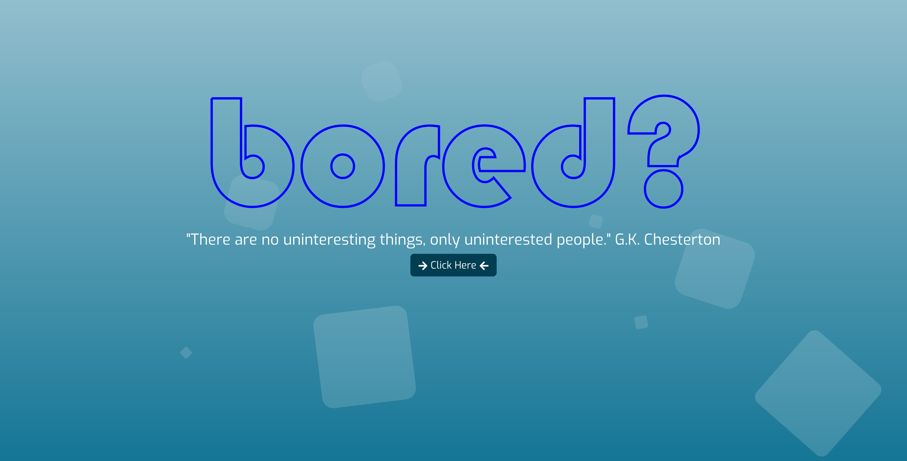
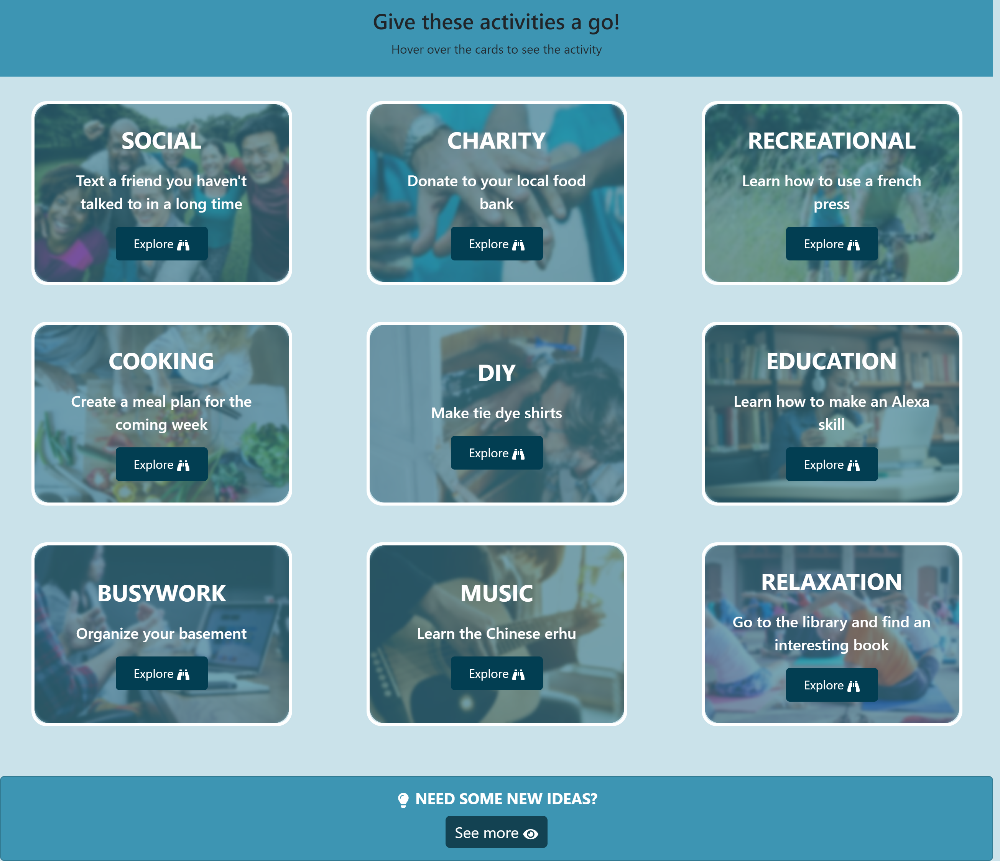

# Bored?

In our team, we have conceived and created our first collaborative front-end, single-page application. We have created a React front end to build a user-focused platform. We used agile development methodologies to help us work collaboratively. We stored our project code in GitHub, managing our work with a project management tool, and implemented features and bug fixes using the Git branch workflow and pull requests. We have used everything we’ve learned during the bootcamp to create a real-world client-side single-page application that we’ll be able to showcase to potential employers. 

## User Story

- **AS** a mobile device user
- **I WANT** to use my time wisely rather than wasting it on social media
- **SO THAT** I can find new things to do at  the click of a button

## Acceptance Criteria

- **WHEN** viewing GitHub repo
- **THEN** folder structure is correct (index.html, CSS folder, style.css, images folder)
- **WHEN** web page viewed
- **THEN** only animation, quote and button are visisble
- **WHEN** 'Click Here' is pressed
- **THEN** 9 cards are dynamically generated with data from boredapi
- **WHEN** a user hovers on a card
- **THEN** title, information about an activty and button scrolls in from the right
- **WHEN** 'Explore' button is pressed
- **THEN** a modal appears with YouTube video linked to specific card and Google search bar
- **WHEN** user inputs search category into Google Search bar
- **THEN** user will be taken to Google search results

## Usage
Deployed Page: https://bored-app-rkll.netlify.app/

## Technologies Used
- Postman: https://web.postman.co/
- Figma: https://www.figma.com/
- VS Code: https://code.visualstudio.com/
- React.js: https://react.dev/ 
- Bootstrap: https://react-bootstrap.github.io/ & https://getbootstrap.com/
- CSS

## APIs used
- YouTube API: https://developers.google.com/youtube/v3
- Bored API: https://www.boredapi.com/

## NPM Modules used
- React SVG Drawing: https://www.npmjs.com/package/react-svg-drawing
- React Icons: https://www.npmjs.com/package/react-icons
- Animejs: https://www.npmjs.com/package/animejs

## Credits
The following websites were used to support this project:
- https://www.youtube.com/watch?v=mAKYW_1f-dw
- https://blog.logrocket.com/exploring-anime-js-example-site-animation-project/
- https://animejs.com/documentation/#lineDrawing
- https://css-tricks.com/scale-svg/
- https://www.youtube.com/watch?v=3RvQJX1_fKQ&t=618s
- https://codepen.io/mohaiman/pen/MQqMyo 

## Colloborators
- Rita Fitchett https://github.com/reets93
- Kamel Beloula https://github.com/kamel-beloula
- Lidia Bhogal https://github.com/LidiaBhogal
- Lissa Simpson https://github.com/lissasimp

## Project Presentation
https://docs.google.com/presentation/d/1i6_o-dKMwr9Z_J4mNsmY9knlEVSNyBfS3uqAzZnFHhw/edit?usp=sharing 

## License

Permission is hereby granted, free of charge, to any person obtaining a copy of this software and associated documentation files (the "Software"), to deal in the Software without restriction, including without limitation the rights to use, copy, modify, merge, publish, distribute, sublicense, and/or sell copies of the Software, and to permit persons to whom the Software is furnished to do so, subject to the following conditions:

